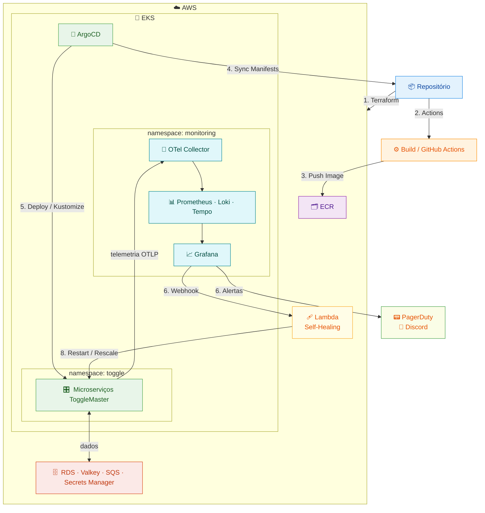

# Tech Challenge Fase 4 - Stack "ToggleMaster"

> Análise geral e implementação comentada do "desafio" da Fase 4 do curso DevOps e Arquitetura Cloud da FIAP.

O ToggleMaster é um sistema que permite ativar ou desativar _"features"_ em produção sem a necessidade de um novo _"deploy"_. Ele foi criado para que times de desenvolvimento possam lançar novas funcionalidades de forma segura e controlada.

Nesta fase, o projeto propõe a monitoração de toda a infraestrutura e dos microserviços do sistema ToggleMaster ([_o mesmo da Fase 3_][fase3]). Para isso, são incluídos recursos de monitoração e observabilidade em um modelo padronizado com o OpenTelemetry. Os microserviços foram padronizados para permitir uma "visibilidade profunda", disponibilizando traces e spans para consulta. Dessa maneira, todo o conjunto é monitorado e observado em detalhes, além de ser integrado a ferramentas de monitoração, alerta e gerenciamento de incidentes. O projeto também inclui a auto-recuperação (_self-healing_) de serviços com o uso do AWS Lambda.

 

## 🌐 Ambiente

O projeto da ToggleMaster com IaaS é composto por alguns recursos principais: os **microserviços**, a **infraestrutura _cloud_** e os **módulos do Kubernetes**. Esses recursos são integrados por meio de algumas ferramentas que também são descritas mais adiante.

O sistema ToggleMaster é segmentado em 5 microsserviços altamente integrados entre si. São eles: [`auth-service`][authserv], [`flag-service`][flagserv], [`targeting-service`][targetserv], [`evaluation-service`][evalserv] e [`analytics-service`][analyticserv], cada um com seu respectivo repositório original, disponibilizado pela FIAP.

Os microserviços são executados em um _cloud provider_, a AWS, para permitir alta flexibilidade, escalabilidade e segurança ao sistema. A infraestrutura da AWS é implementada com o Terraform, e foi segmentada em módulos a fim de automatizar e flexibilizar a criação do ambiente.

Com o ambiente AWS criado, os microsserviços, então, são executados em um cluster Kubernetes (K8s), o EKS da AWS. Diversos manifestos K8s foram criados para definir como o sistema ToggleMaster deve ser executado e escalado nesse ambiente. Também é implementado no cluster o ArgoCD para que o _deploy_ seja automatizado e sincronizado com o repositório Git, tornando-o o ponto central de controle e manutenção do código do sistema.

 

## 🏗️ Arquitetura

A arquitetura do ambiente possui algumas camadas principais, descritas a seguir.

- **Terraform** - Provisiona toda a infraestrutura, como VPC, EKS, RDS, Valkey, SQS, Secrets, políticas IAM e stack de monitoramento, etc.
- **CI/CD** - O fluxo de GitOps é realizado com o GitHub Actions que constrói as imagens e as envia ao ECR utilizando o OIDC. O ArgoCD busca os dados no repositório para a implementação no cluster Kubernetes.
- **AWS EKS** - O cluster Kubernetes que foi dividido em dois namespaces principais:
    - No **`toggle`**, ficam os cinco microserviços, cada um com suas próprias responsabilidades. O `evaluation-service` chama internamente o `flag-service` e o `targeting-service`, e todos buscam a autorização no `auth-service`. O `analytics-service` consome as mensagens do SQS.
    - No **`monitoring`**, o _OTel Collector_ é o ponto central para o qual todos os serviços enviam telemetria OTLP, e ele roteia métricas para o Prometheus, logs para o Loki e traces/spans para o Tempo. O Grafana consulta esses dados para as consultas e vizualização nas dashboards.
- **AWS SQS/RDS/Valkey/Secrets** - O **RDS** é a base de dados dos microserviços `auth`, `flag` e `targeting`; o ElastiCache Valkey/Redis faz o cache do microserviço `evaluation`; o **SQS** recebe as publicações do `evaluation`, que são consumidas pelo `analytics`. Por fim, o **Secrets Manager** gerencia as credenciais.
- **K8s OTel/Prometheus/Loki/Tempo/Grafana** - Esta é a camada de métricas e observabilidade, que traz informações sobre o estado e a saúde do ambiente.
- **AWS Lambda** - É utilizado para a automação de recuperação dos microserviços.

De forma simplificada, este é o fluxo geral de implementação do sistema ToggleMaster:

 

## 🔑 Prerequisitos de implementação

**1.** De preferência, faça um **"_fork_" deste repositório** para possibilitar a execução do CI workflow. Ele é utilizado para testar e, principalmente, para enviar as imagens dos microserviços ao AWS ECR.

> **É necessário habilitar o serviço de `Actions` no repositório.**

**2.** Copie todo o código-fonte do repositório para um ambiente de execução/desenvolvimento local. Recomenda-se **clonar o repositório com o Git**:

> **`git clone https://github.com/SUA_CONTA/FORK_DO_REPO.git && cd FORK_DO_REPO`**

**3.** O ambiente de execução/desenvolvimento local deve estar **autenticado na AWS** com o [**AWS CLI**][awscli], pois ele será utilizado em algumas configurações mais adiante.

**4.** É necessário [**instalar o Terraform**][terraform] no ambiente de execução/desenvolvimento local para implementar os serviços da AWS que serão utilizados pelo sistema ToggleMaster;

**5.** O **`kubectl`** é necessário para gerenciar o cluster Kubernetes e seus recursos. Recomenda-se instalá-lo utilizando o [**repositório oficial do Kubernetes**][kuberepo];

**6.** _(Opcional)_ O [**cliente ArgoCD CLI**][argocdcli] pode ser instalado no ambiente local para auxiliar nas configurações da ToggleMaster no cluster. No roteiro de implementação, são apresentados alguns exemplos que o utilizam. No entanto, também é possível sincronizar os manifestos da ToggleMaster diretamente na interface do ArgoCD.

 

---

### [↗️ Roteiro de implementação do ambiente](/roteiro/)

### [↗️ Teste dos serviços](/roteiro/teste.md)

---

 

## 📝 Considerações

🔶 **As APMs Datadog e New Relic não foram implementadas** nesta fase do projeto, considerando os seguintes aspectos:

- **Datadog**: [exige conexão com serviços de terceiros (_GitHub_)][datadog_edu] para acesso educativo. Por sua vez, o GitHub exige, por meio de seu [pacote para estudantes][github_edu], exige informações de identificação governamentais e um rastreamento biométrico **altamente invasivo** para registro. Esses dados podem ser utilizados pelo GitHub e seus parceiros, incluindo a Datadog, sem garantias reais de privacidade, e podem de auxiliar em perfilarizações comerciais e treinamentos de IA.
- **New Relic**: o [portal tem recusado conexões][newrelic] (_`ERR_CONNECTION_REFUSED`_) durante o desenvolvimento desta fase. Não foi possível acessar os recursos desse serviço.
- Entendo, **portanto**, que essas são ferramentas privadas de custo elevado e com acesso educacional relativamente invasivo. Não foram percebidos benefícios reais para os usuários em contextos educacionais. Como existem ferramentas alternativas, o [**Grafana Tempo**][grafanatempo] é utilizado no projeto para o rastreamento dos serviços, pois faz parte do ecossistema Grafana, é compatível com o OpenTelemetry e não tem custos, sendo _open-source_.

🔶 O **PagerDuty** foi utilizado como central de eventos para a ToggleMaster, pois permite uo gerenciamento integrado de eventos e incidentes gerais com equipes de TI e alta integração com diversas outras ferramentas de mercado. O **OpsGenie** é desconsiderado neste projeto, pois o fabricante [anunciou o "fim-de-vida" da ferramenta][fimvida]. Uma alternativa interessante para o projeto é o [**Grafana IRM**][grafanairm], que já é integrado ao ecossistema Grafana e aos demais recursos utilizados. No entanto, ele também possui um custo adicional.

> **É importante destacar que também existem [outras ferramentas][alternative] de gerenciamento de eventos e escalonamento que não têm custo, oferecem alta diversidade de integrações e automações possíveis (incluindo IA) e oferecem maior privacidade aos usuários. Elas não foram testadas neste ambiente para evitar o desvio do objetivo.**

🔶 A **_stack_ de monitoração** tem o perfil de uma ferramenta de plataforma, não de uma aplicação de negócio. Por isso, foi adicionada como um novo módulo de monitoramento do Terraform ([`/modules/mon`][monitoring]).

🔶 O ambiente utiliza o **AWS Lambda** para automatizar a auto-recuperação dos microserviços, pois está no próprio ambiente da AWS e tem maior integração com os demais recursos. Como o Lambda é compatível com o Terraform e, também se tornou um módulo adicional.

[fase3]: https://github.com/diasdmhub/fiap-toggle-master-iaas
[authserv]: https://github.com/FIAP-TCs/auth-service
[flagserv]: https://github.com/FIAP-TCs/flag-service
[targetserv]: https://github.com/FIAP-TCs/targeting-service
[evalserv]: https://github.com/FIAP-TCs/evaluation-service
[analyticserv]: https://github.com/FIAP-TCs/analytics-service
[awscli]: https://aws.amazon.com/cli
[terraform]: https://developer.hashicorp.com/terraform/install
[kuberepo]: https://kubernetes.io/docs/tasks/tools
[argocdcli]: https://argo-cd.readthedocs.io/en/stable/cli_installation
[datadog_edu]: https://studentpack.datadoghq.com
[github_edu]: https://education.github.com/pack
[newrelic]: https://newrelic.com
[grafanatempo]: https://grafana.com/oss/tempo
[alternative]: https://alternativeto.net/software/pagerduty/?license=free&sort=likes
[fimvida]: https://www.atlassian.com/software/opsgenie/migration
[grafanairm]: https://grafana.com/products/cloud/irm
[monitoring]: /modules/mon/