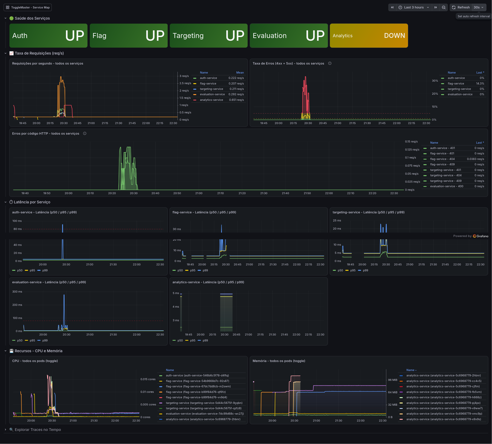
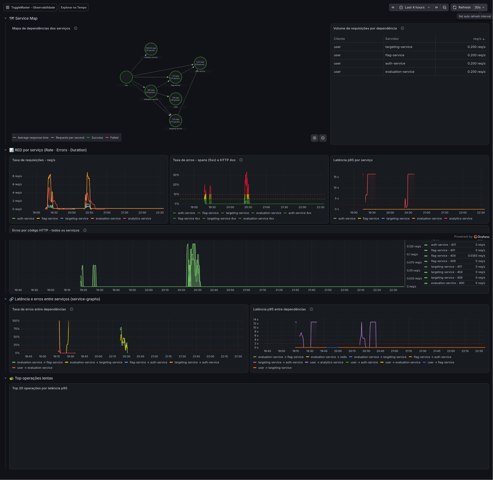
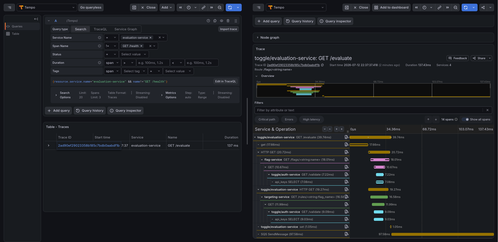
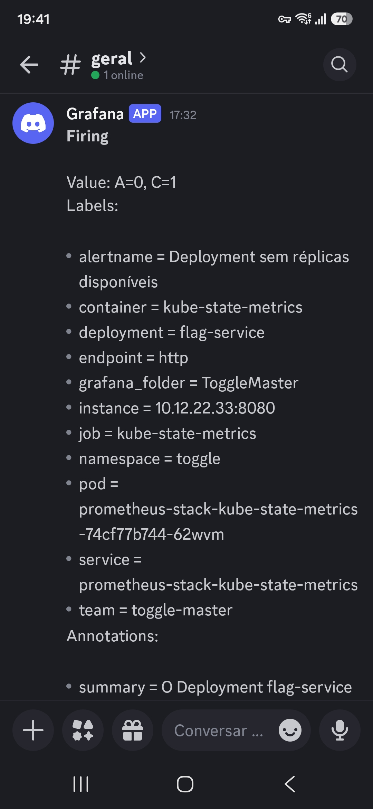
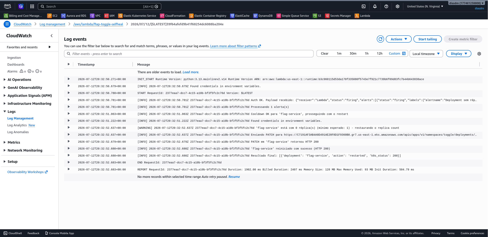

# Evidências

> **Seguem algumas evidências da implementação do projeto.**

<BR>

### Dashboards do Grafana

Os manifestos dessas dashboards estão disponíveis no diretório `/dash` do repositório. Elas demonstram diversas métricas do sistema ToggleMaster.





<BR>

### Trace distribuído no Tempo

Esta é uma demonstração do _trace_ de requisições no Grafana Tempo.



<BR>

### Notificação de incidente no Discord

O Discord foi escolhido como uma das plataformas de notificação devido à sua simplicidade de integração. A imagem a seguir evidencia essa integração.



<BR>

### Registro da automação de Self-Healing no AWS Lambda

Com o Tempo, as requisições podem ser rastreadas rapidamente, conforme demonstrado na imagem a seguir.

#### Requisição:

```shell
# curl "http://aef8d90b5616c4bb691a9c89892d7274-2051342699.us-east-1.elb.amazonaws.com:8004/evaluate?user_id=testando-100&flag_name=enable-feature"
{"flag_name":"enable-feature","user_id":"testando-100","result":true}
```

#### Consulta:

